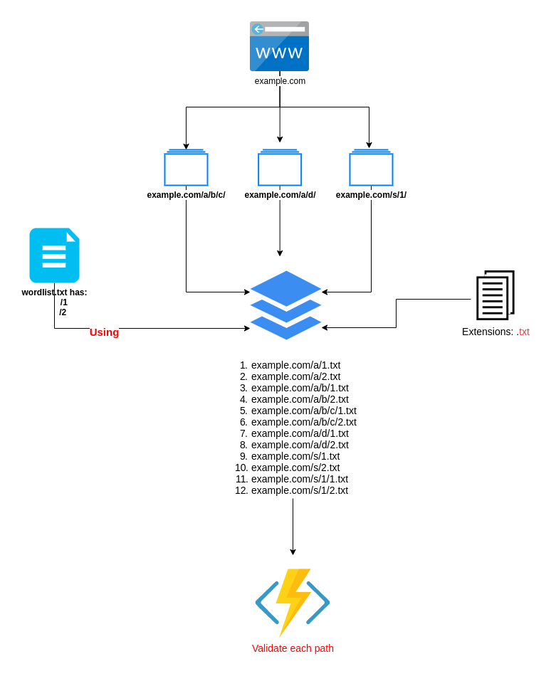

# chru
#### Fetch URLs, do segmentation then append endpoints for each path/route

#### USAGE:
    - chru [OPTIONS] --host <host> --wordlist <path>

#### FLAGS:
       --help       Prints help information
     -V, --version    Prints version information

#### OPTIONS:
     -d, --depth <depth>                Segmentation Depth [default: 10]
     -e, --extensions <ext>...          List of common extensions, such as .js,.txt,.asp.net
     -T, --text <filter-text>           Text/word in Response [default: ]
     -h, --host <host>                  Target URL
     -l, --link-option <link>           URLs Options to Fetch [Interal=I, External=E or ALL=A] [default: I]
     -t, --threads <nthreads>           Number of Threads [default: 50]
     -w, --wordlist <path>              Endpoints file path
     -s, --status-code <status-code>    Status Code to print [default: 0]

#### TODO:
    - [ ] JS Parser
    - [ ] Validate paths based on two different roles/tokens
    - [ ] Include endpoints and the parameters in the validation
    - [ ] Improve the filter
    - [ ] Output without validation
    - [ ] Add insecure TLS option
#####  Example: 
    chru -h https://example.com -l I -w endpoints.txt -d 10 -t 30 -T "Google developer" -s 200
	     Output: 
	     Running `target/debug/chru -h 'https://example.com' -l I -w endpoints.txt -d 10 -t 30 -T 'Google developer' -s 200`
	     [*] Target: https://example.com
	     [*] Number of Threads: 30
	     [*] Number of Requests: 3740

	     [+] /apis                                                         | 200 OK | 5325 Bytes

